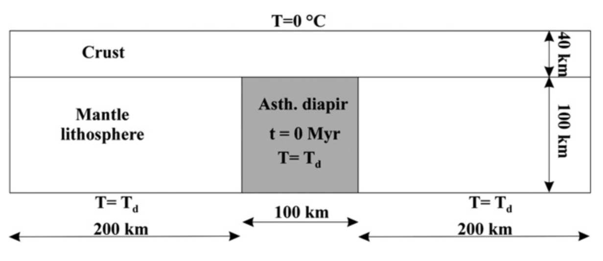

intrusion_heatflow: Numerical modelling of geological heat flow
---------------------------------------------------

`intrusion_heatflow.m` is a `matlab` script for finite difference modelling of heat flow from an igneous intrusion in the Earth's crust. Based off the paper:

Pascal, C., & Olesen, O. (2009). Are the Norwegian mountains compensated by a mantle thermal anomaly at depth?. Tectonophysics, 475(1), 160-168. [Article](https://www.sciencedirect.com/science/article/pii/S0040195109000195)

Heat flow from an asthenospheric diapir that interacts with the base of a cold crustal lithosphereis modeled ((see Figure 1), and calculations were made by using 2D finite element thermal modelling.

`intrusion_heatflow_gif.m` is a `matlab` script that makes a gif file of the previous animation.

E.g.

License
-------

This project is licensed under the terms of the [MIT license](LICENSE).

